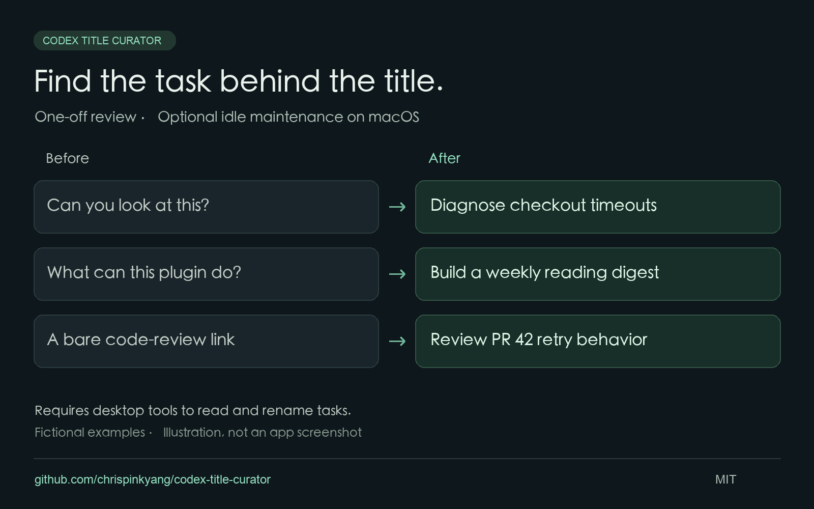

# Codex Title Curator

**Keep task titles useful as your Codex conversations evolve.**

[中文](README.md) · [Skill instructions](SKILL.md) · [Idle maintenance](references/idle-maintenance.md) · [Report an issue](https://github.com/chrispinkyang/codex-title-curator/issues)

A conversation can move well beyond its opening question. I made this skill to help Codex summarize a task's actual purpose from the original request and recent substantive turns, so it is easier to find later.



*Fictional examples illustrating the intended behavior, not an app screenshot.*

## What it does

- Reviews unclear or outdated titles of local, unarchived main tasks active within the last 30 days by default.
- Preserves useful titles, explicit user choices, and detectable external title edits.
- Records old and new titles and verifies changes through the app's title tool.
- Offers optional idle maintenance: check hourly, wait for at least 15 minutes of macOS keyboard/mouse inactivity, and finish at most one review per day. Successful scheduled reviews stay quiet.

## Requirements

**Your Codex desktop session must expose tools to list tasks, read conversations, and rename tasks.** Installing a skill does not provide these tools. If they are missing, the skill can suggest titles but cannot apply them.

The helper scripts need Python 3.9+. Idle maintenance additionally requires macOS, scheduling support, and an available computer and app. Other operating systems can use manual mode when the required task tools are available.

This is a community skill. Installing it does not rename tasks or create an automation.

## Install

With Node.js and the skills CLI:

```sh
npx skills add chrispinkyang/codex-title-curator --agent codex --skill codex-title-curator --global
```

See [skills CLI documentation](https://skills.sh/docs/cli) for installation telemetry and opt-out settings.

Or clone it into your personal skills directory:

```sh
mkdir -p ~/.agents/skills
git clone https://github.com/chrispinkyang/codex-title-curator.git ~/.agents/skills/codex-title-curator
```

Check any existing installation before cloning. You can also give this repository URL to Codex's `$skill-installer`. See [OpenAI's skills documentation](https://learn.chatgpt.com/docs/customization/overview#skills) for supported locations.

## Try it

Start with a preview:

```text
Use $codex-title-curator to review titles of tasks active in the last 30 days.
Show the proposed old-to-new title mapping without changing anything.
```

To apply changes:

```text
Use $codex-title-curator to update unclear titles of tasks active in the last 30 days.
```

To opt into recurring maintenance:

```text
Use $codex-title-curator to maintain my task titles once a day when my computer is idle.
Stay quiet on success; I will see the updated titles when I return.
```

## Boundaries and privacy

Codex chooses titles from context; the Python helper handles idle checks, candidate discovery, and private checkpoints. The skill instructs Codex to skip running tasks, tasks with unknown status, child agents, and identifiable scheduled checks.

Renaming uses the app's tool. The helper never modifies the app database. Its optional SQLite inventory reads a version-dependent schema and cannot establish live task status. Unsupported schemas stop that path and require disclosing incomplete coverage.

Idle detection measures keyboard/mouse inactivity, so it cannot tell whether you are reading. Hourly checks still wake the agent and may consume usage.

The helper has no network calls or third-party runtime dependencies and does not read credentials. Conversation content is processed in your current Codex session under the product's data settings. Checkpoints and rollback records stay outside the repository, under `$CODEX_HOME/title-curator/` or `~/.codex/title-curator/`.

For feedback, include your operating system, Codex version, and fictional examples. Do not upload real task inventories, transcripts, IDs, databases, or audit logs.

## Development

```sh
python3 -m unittest discover -s tests -v
```

Tests use temporary directories and synthetic databases without changing real tasks.

## License

[MIT](LICENSE)
