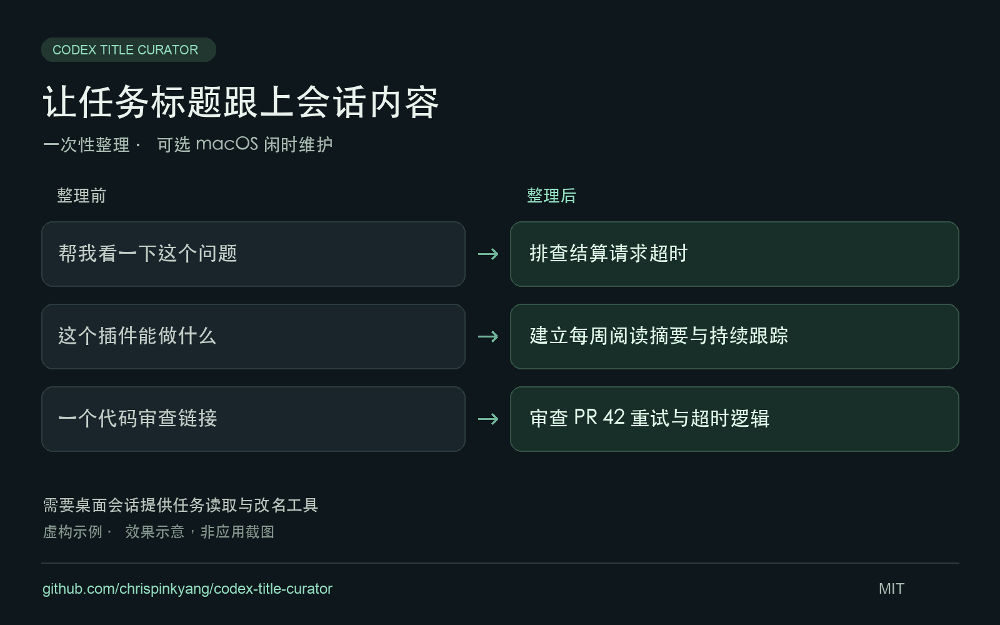

# Codex Title Curator

**让任务标题跟上会话的实际内容，方便找回之前的工作。**

[English](README.en.md) · [使用规则](SKILL.md) · [闲时维护](references/idle-maintenance.md) · [反馈问题](https://github.com/chrispinkyang/codex-title-curator/issues)

用 Codex 时，我发现有些会话已经聊到了新的具体目标，标题却还停留在开头那句话。所以我整理了这个 skill，让 Codex 根据原始需求和近期内容，重新概括任务标题。我自己用下来，更容易找到之前的会话了。



*图中均为虚构示例，是效果示意，不是应用截图。*

## 有什么用

- 从首次需求和近期内容概括主题，修正截断首句、裸链接和过时标题。
- 保留已经清楚的标题、用户明确指定的标题，以及可识别的外部改名。
- 按需整理最近 30 天的本机任务，记录可回退的新旧标题。
- 可选：每小时检查，闲置至少 15 分钟后整理，每天最多完成一轮。成功时安静，用户回来即可看到结果。

以下示例均为虚构：

| 原标题 | 整理后 |
|---|---|
| 帮我看一下这个问题 | 排查结算请求超时 |
| 这个插件能做什么 | 建立每周阅读摘要与持续跟踪 |
| 一个代码审查链接 | 审查 PR 42 重试与超时逻辑 |

## 安装与使用

需要 **Codex 桌面会话提供任务列表、读取会话和修改标题的工具**。安装 skill 不会提供这些工具。自动化需要调度能力；辅助脚本需要 Python 3.9+。空闲检测目前支持 macOS，其他系统在具备任务管理工具时可手动使用。

已安装 Node.js 时，可使用 skills CLI 安装为个人 skill：

```sh
npx skills add chrispinkyang/codex-title-curator --agent codex --skill codex-title-curator --global
```

CLI 安装成功不代表当前会话具有改名工具，第一次使用仍需检查能力。安装遥测与关闭方式见 [skills CLI 说明](https://skills.sh/docs/cli)。

也可以使用 Git：

```sh
mkdir -p ~/.agents/skills
git clone https://github.com/chrispinkyang/codex-title-curator.git ~/.agents/skills/codex-title-curator
```

目录已存在时先检查现有安装。也可向 Codex 的 `$skill-installer` 提供本仓库链接。不同版本的技能目录可能不同，参见 [OpenAI 官方说明](https://learn.chatgpt.com/docs/customization/overview#skills)。

第一次使用时，可以先查看建议：

```text
使用 $codex-title-curator，检查最近 30 天活跃任务的标题。
先列出建议的新旧标题，不要修改。
```

需要直接整理时，在 Codex 中输入：

```text
使用 $codex-title-curator，整理最近 30 天活跃任务的标题。
```

或开启后台维护：

```text
使用 $codex-title-curator，每天在电脑闲置时整理一次任务标题。
成功不要通知我；我回来时看到更新就好。
```

安装本身不会创建自动化或修改标题。建议先人工触发一次，确认效果和工具可用性。

## 边界与隐私

- 社区 Skill，不是 OpenAI 官方功能。工具不可用时提供建议映射，不直接修改应用数据库。
- 标题由 Codex 结合上下文判断；脚本只负责空闲检查、候选枚举和进度状态。
- 默认处理本机未归档主任务，跳过运行中的任务、子代理和可识别的巡检。不会把列表首页当作全量范围。
- SQLite 枚举依赖版本相关的应用存储结构，不是稳定公开 API，也无法判断任务是否正在运行。
- 空闲检测基于键盘鼠标活动，不能保证用户没有在阅读。每小时检查仍会唤醒模型，可能消耗用量；电脑和应用需保持可运行。
- 脚本不联网、不读取凭据、不将历史发给额外服务；内容仍由当前 Codex 会话处理，遵循你使用产品的数据设置。
- 状态及回退记录存于仓库之外：`$CODEX_HOME/title-curator/`，未设置时为 `~/.codex/title-curator/`。不要提交真实标题、会话 ID、数据库或日志作为示例。

## 开发验证

```sh
python3 -m unittest discover -s tests -v
```

测试使用临时目录和合成数据库，不修改真实任务。运行时无需第三方 Python 包。

## 反馈

欢迎在 [Issues](https://github.com/chrispinkyang/codex-title-curator/issues) 反馈安装问题、缺失的工具，或整理后仍不好辨认的标题。请附上操作系统、Codex 版本和经过改写的虚构示例，不要上传真实会话内容。

## English

[Full English guide: requirements, installation, and first use](README.en.md).

A community skill that turns conversation goals into recognizable Codex task titles. It reads original requests and recent substantive turns, preserves useful and manually edited titles, and applies authorized changes through the app's title tool.

Install the repository in your personal skills directory, then ask:

```text
Use $codex-title-curator to update unclear titles of tasks active in the last 30 days.
```

Recurring maintenance is opt-in: a suggested setup checks hourly, waits for 15 minutes of macOS keyboard/mouse inactivity, and finishes at most once per local day. It rechecks activity before writes and stays quiet on success. Manual mode supports other systems. This is a skill for sessions with task-management tools, not a standalone title-generation CLI.

The Python helper has no network calls or third-party dependencies. It reads local metadata without modifying it. Runtime state and rollback logs stay outside the repository. The SQLite fallback is version-dependent; hourly agent wakeups can consume usage.

## License

[MIT](LICENSE)
